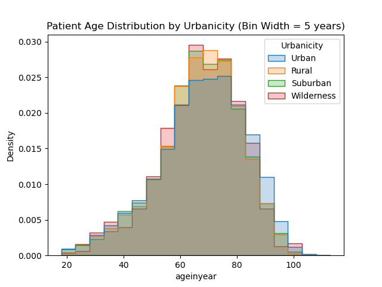

# EDA with Visualizations

## Count of Patients by Urbanicity
To start investigating some variables in the dataset, we wanted to gain a sense for how many patients in the dataset are from rural vs. urban zones:

## Distribution by Urbanicity

We can see that the vast majority of the dataset is for patients in urban zones. This should be kept in mind for future analyses. We can also start to get a sense for the ages of patients within a regional type:

<table>
<tr>
<td></td>
<td></td>
</tr>
</table>

## Distribution of Age

Next, we wanted to get a sense for the age distribution of patients with cardiac events:

<table>
<tr>
<td></td>
<td></td>
</tr>
</table>

We can see that the patient age distribution is negatively skewed - which makes sense because we'd expect more patients experiencing cardiac events to be older, with fewer children experiencing cardiac events.

## Distribution of Age by Urbanicity

We also plotted a histogram of age using probability density, with shading by urbanicity:

<table>
<tr>
<td></td>
<td></td>
</tr>
</table>
<table>
<tr>
<td></td>
<td></td>
</tr>
</table>

This was interesting because we can see that patients from rural areas, wilderness zones, and the suburbs have a higher proportion of cardiac events between the ages of 60 - 80, with a lower proportion of urban dwellers experiencing cardiac events in this age bracket. This histogram also shows that urban dwellers represent a higher proportion of the patients > 80 years old. 

This hints at different survival rates between rural and urban zones, which Aaron Fihn demonstrated in their Chi-Square test. To better understand this difference, one direction for further research could be using the other NEMSIS data to investigate whether there are different resources available, types of treatments being done, etc. for patients in urban zones vs. rural zones. 
