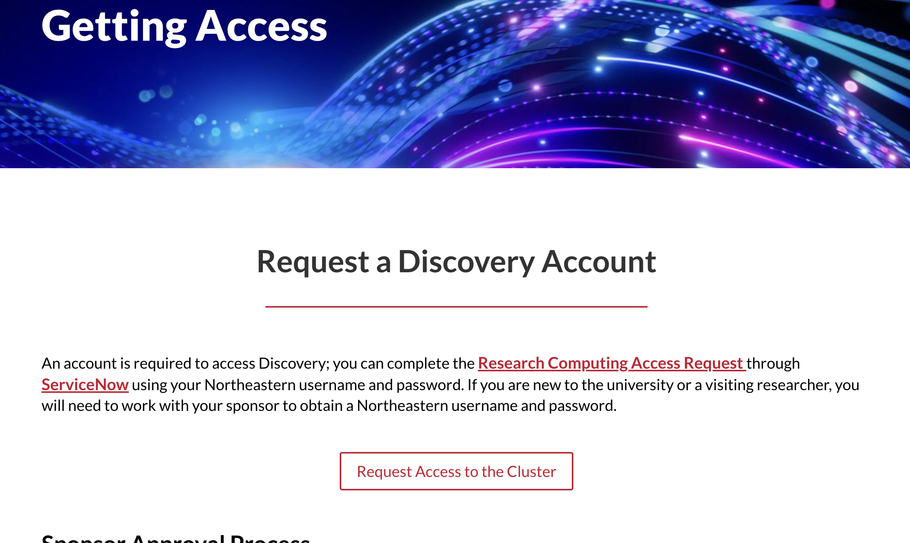
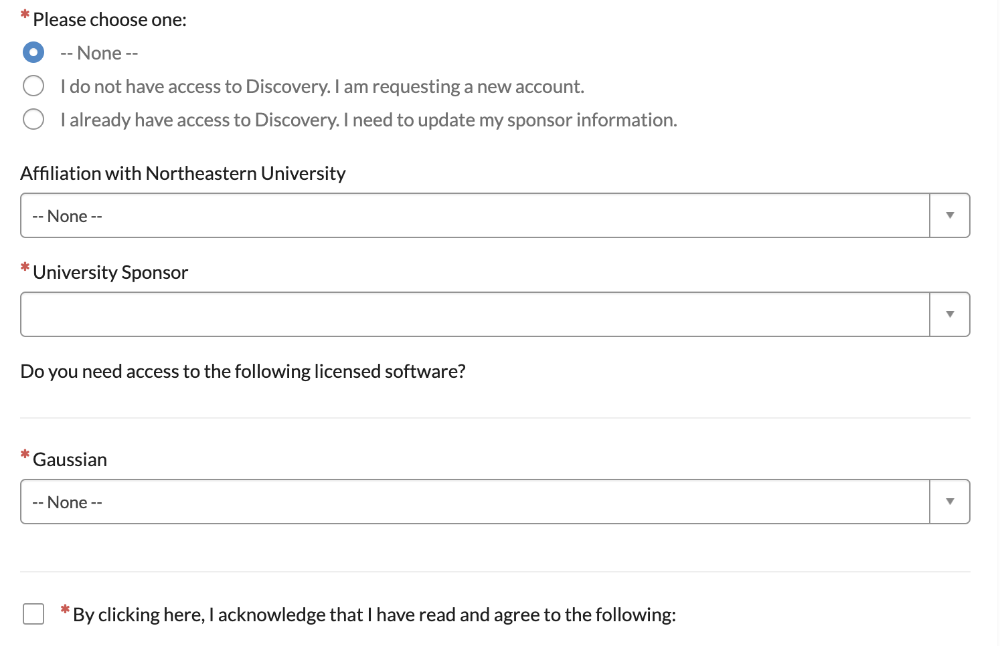

# Discovery Account Access Guide

This guide is intended to assist subsequent students working on the NEMSIS 911 project with requesting access to a Discovery Account on Northeastern University's Remote Computing Platform. Follow the steps below to obtain access and set up your account.

## Instructions for Requesting Access to the Discovery Remote Computing Cluster

### Navigate to the Remote Computing Platform Website

- Click the following link to go to the platform: [Remote Computing Platform Access Page](https://rc.northeastern.edu/getting-access/).
- You will see a page describing the different access options for Northeastern's computing resources.
- Click on "Request Access to the Cluster".
- Enter your Northeastern credentials when prompted.

### Fill Out the Access Request Form

- After clicking on the "Request Access to the Cluster" button, you will be redirected to a request form.
- Fill out the required fields. You will need to list your University Sponsor (professor/faculty member).

### Submit the Request Form

- Once the form is complete, click "Submit" to send in your request.
- You should receive an email confirmation that your request is being processed and an access request ticket has been opened. It may take a few business days for approval and your University Sponsor will likely receive an email requesting their approval.

### Set Up Your Access Once Approved

- Once you receive approval, follow the instructions provided in the email to set up your access to the Discovery platform.

## Additional Notes

- For additional help regarding setup or usage of the platform, consult the Discovery Cluster's training page: https://rc.northeastern.edu/support/training/

Please update this document with relevant screenshots to further assist future students.
